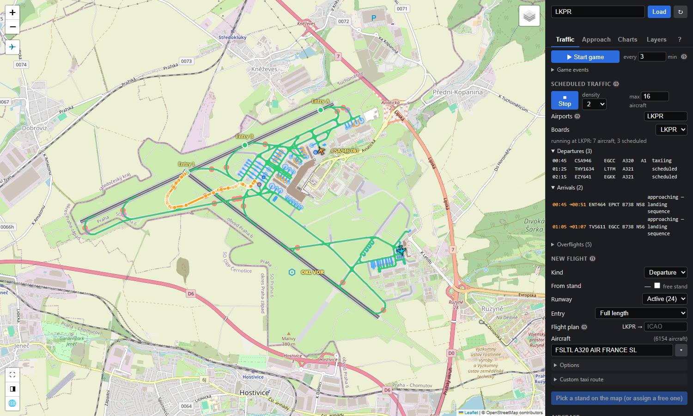

# mrlm-net/simconnect

[](https://pkg.go.dev/github.com/mrlm-net/simconnect)
[](https://simconnect.mrlm.net/)

> **Go wrapper for SimConnect.dll** — build Microsoft Flight Simulator 2020/2024 add-ons with type-safe, zero-dependency Go code.

## Features

### Engine — Direct SimConnect Access
- Full SimConnect DLL binding via syscalls — zero CGo, Windows-only
- Typed message stream via Go channels with callback handlers
- Manual and pre-built dataset definitions across 7 domains (aircraft, environment, facilities, navigation, objects, simulator, traffic)
- AI traffic management — create, remove, and control parked, enroute, and non-ATC aircraft with livery selection
- Facility data queries — airports, runways, parking, frequencies, VOR, NDB, waypoints, jetways, helipads, and 14 facility types total
- Optional SimConnect.dll auto-detection (`ClientWithAutoDetect`) via environment variables, SDK paths, and common installation locations

### Manager — Production Lifecycle
- Automatic connection lifecycle with reconnection and health monitoring
- 60+ SimVar state tracking via SimState — camera, position, speed, weather, VR, environment, realism settings
- Channel-based and callback-based subscriptions with message type filtering
- 12 typed system event handlers — Pause, Sim, Crashed, CrashReset, Sound, View, FlightLoaded, AircraftLoaded, FlightPlanActivated, FlightPlanDeactivated, ObjectAdded, ObjectRemoved

### Airport & Ground Traffic
- Airport ground layout from facility data — runways with both ends, parking stands (`C22`, `S22A`), taxi points with hold-shorts, taxi paths and taxiway names
- Taxi graph and routing — stand → runway hold-short with taxiway sequence and runway crossings; GeoJSON export
- Departure taxi controller — spawn an AI aircraft at a stand, push back (with a tug), taxi, hold short and take off; SIDs and generated flight plans after the take-off
- Arrivals — STAR and approach, injected landing, runway exit, taxi-in and parking on a suitable stand; turnarounds
- Injected ground movement — smooth turns, real speeds, lights as set, give way and queue behind traffic, pushback that waits for traffic behind; ATC commands (hold position, go around, abort take-off); de-icing; natural timing
- Traffic picture — every aircraft around a configurable centre of the world (an airport, a position, or following the user) with phases and the airports in range
- Scheduled traffic — timetables from airlines, fleets, routes and time-of-day waves; a traffic manager that spawns them, turns arrivals around, and adjusts to what it sees (landing flow, ground stops, late inbounds, stuck aircraft), respecting or ignoring traffic that is not ours; lifecycle events for your own state machine
- Enroute traffic and overflights — aircraft appear airborne mid-route on their flight plan and are handed to the arrival at the STAR entry
- Many aircraft at once — level of detail (fewer frames far away or standing still), reusable ID blocks
- Library components never own the message stream: your loop feeds `Handle(msg)`, so they work alongside the Manager

### Airborne ATC
- Wake turbulence separation (ICAO and RECAT-EU) and spacing on final that follows the weather (low visibility, runway state, wind)
- A landing sequence per runway, first come first served, re-sequencing go-arounds; arrivals lose delays by speed, then a longer downwind, then a hold with its stack
- A tower per runway: line-up, take-off and crossing clearances in mixed mode; automatic go-arounds on the published missed approach
- Airborne conflicts predicted five minutes ahead and resolved by the least disturbing speed, level or heading change
- Standard-rate turns by airframe instead of MSFS AI's hard turns at waypoints; injected take-off with engine spool-up and a stable glide path to touchdown
- On the airport map: an Approach tab with the sequence, the tower and the final's spacing, and controls to work it by hand

### Navigation & Weather
- Airways crawled from the simulator's navigation data and routed (A*); weather at the user aircraft, the runway in use, ATIS
- Flight plans between airports — SID, airways, STAR and approach, cruise level, vertical profile, fuel; MSFS `.pln` export

### Utilities
- Great-circle distance (haversine), altitude/distance/speed conversions, ICAO validation, WGS84 coordinate offsets
- Tiered buffer pooling and pre-allocated handler buffers for zero-allocation dispatching

*Zero external dependencies — standard library only.*

## Quick Start

```go
package main

import (
    "github.com/mrlm-net/simconnect"
)

func main() {
    client := simconnect.NewClient("MyApp", simconnect.ClientWithHeartbeat(simconnect.HEARTBEAT_6HZ))
    if err := client.Connect(); err != nil {
        panic(err)
    }
    defer client.Disconnect()
    // … interact with the simulator
}
```

## Examples

Start with the **[airport map](examples/airport-map)**, the SDK's main example and the tool it is debugged with. It shows an airport's ground layout as SimConnect reports it, taxi routes, AI traffic under your control, scheduled airline traffic, the landing sequence, the tower and the ATC game, all built on this SDK:

```shell
cd examples/airport-map && go run .
# open http://127.0.0.1:8080/?icao=LKPR
```



[Examples](docs/examples.md) has a tour of the map with screenshots and a line on every other example. Each is a standalone `main` package; run one with `go run ./examples/<name>`:

- **Connection & Manager** — [basic-connection](examples/basic-connection), [await-connection](examples/await-connection), [lifecycle-connection](examples/lifecycle-connection), [simconnect-manager](examples/simconnect-manager), [simconnect-subscribe](examples/simconnect-subscribe), [simconnect-state](examples/simconnect-state), [simconnect-events](examples/simconnect-events), [simconnect-benchmark](examples/simconnect-benchmark)
- **Data & Events** — [read-messages](examples/read-messages), [read-objects](examples/read-objects), [set-variables](examples/set-variables), [using-datasets](examples/using-datasets), [emit-events](examples/emit-events), [subscribe-events](examples/subscribe-events), [flow-events](examples/flow-events)
- **Facilities** — [read-facility](examples/read-facility), [read-facilities](examples/read-facilities), [subscribe-facilities](examples/subscribe-facilities), [all-facilities](examples/all-facilities), [airport-details](examples/airport-details), [locate-airport](examples/locate-airport), [read-waypoints](examples/read-waypoints), [simconnect-facilities](examples/simconnect-facilities)
- **Traffic** — [ai-taxi](examples/ai-taxi) (stand → runway departure), [ai-arrival](examples/ai-arrival) (landing, runway exit, taxi-in), [ai-traffic](examples/ai-traffic), [manage-traffic](examples/manage-traffic), [monitor-traffic](examples/monitor-traffic), [simconnect-traffic](examples/simconnect-traffic)
- **Navigation & Weather** — [atis](examples/atis), [flight-plan](examples/flight-plan), [spike-airways](examples/spike-airways)
- **Spikes** — `examples/spike-*`: one-off experiments behind the traffic features

## CLI Tools

### simvar-cli

`simvar-cli` is a Windows command-line tool for reading, writing, and streaming MSFS SimVars directly from a terminal. It connects to a running simulator via SimConnect and supports JSON, CSV, and table output formats.

```shell
# Build from source
cd cmd/simvar-cli
go build -o simvar-cli.exe .

# Read a SimVar
simvar-cli get "PLANE ALTITUDE" feet float64

# Stream continuously as NDJSON
simvar-cli --format json watch "PLANE ALTITUDE" feet float64

# Interactive REPL
simvar-cli repl
```

See [`cmd/simvar-cli`](cmd/simvar-cli) for the full README and [`docs/simvar-cli.md`](docs/simvar-cli.md) for the complete reference.

## Documentation

**[simconnect.mrlm.net](https://simconnect.mrlm.net/)** — Full documentation website with getting started guide, configuration reference, and usage guides.

- [Examples](https://simconnect.mrlm.net/docs/examples) — The airport map and every other example
- [Client Configuration](https://simconnect.mrlm.net/docs/config-client) — Engine/Client functional options
- [Client API Reference](https://simconnect.mrlm.net/docs/usage-client) — Complete Engine/Client API
- [Manager Configuration](https://simconnect.mrlm.net/docs/config-manager) — Manager functional options
- [Manager Usage](https://simconnect.mrlm.net/docs/usage-manager) — Lifecycle management, subscriptions, state handling
- [Request ID Management](https://simconnect.mrlm.net/docs/manager-requests-ids) — ID allocation strategy and conflict prevention
- [Event Lifecycle](https://simconnect.mrlm.net/docs/events-lifecycle) — Event lifecycle reference
- [Airport Layout & Taxi Routing](https://simconnect.mrlm.net/docs/airport-layout) — `pkg/airport` loading, layout model, facility data semantics, routing
- [Traffic Guide](https://simconnect.mrlm.net/docs/traffic-guide) — AI aircraft with `pkg/traffic`
- [Departure Taxi](https://simconnect.mrlm.net/docs/traffic-taxi) — Stand → runway taxi controller
- [Arrivals](https://simconnect.mrlm.net/docs/traffic-arrival) — Landing, runway exit, taxi-in and parking
- [Injected Ground Movement](https://simconnect.mrlm.net/docs/traffic-motion) — Motion, pushback, natural timing, many aircraft (level of detail, ID blocks)
- [Traffic Commands](https://simconnect.mrlm.net/docs/traffic-commands) — Hold position, go around, abort take-off
- [Aircraft Profiles](https://simconnect.mrlm.net/docs/traffic-profiles) — Per-type profiles, SimVar refinement, telemetry
- [Traffic Picture](https://simconnect.mrlm.net/docs/traffic-picture) — All traffic around a centre of the world
- [Traffic Schedules](https://simconnect.mrlm.net/docs/traffic-schedules) — Airlines, routes and time-of-day waves
- [Traffic Manager](https://simconnect.mrlm.net/docs/traffic-manager) — Schedule to traffic, situation checks, other traffic, enroute and overflights, events
- [Airborne Separation](https://simconnect.mrlm.net/docs/traffic-separation) — Wake categories, spacing on final, landing sequence, delays and holding, the runway controller, go-arounds, conflicts, working the approach
- [Airways](https://simconnect.mrlm.net/docs/nav-airways), [Weather & ATIS](https://simconnect.mrlm.net/docs/nav-weather), [Flight Plans](https://simconnect.mrlm.net/docs/nav-flight-plans) — `pkg/nav`

## Packages

- **[`simconnect`](https://pkg.go.dev/github.com/mrlm-net/simconnect)** — Main entry point — `New()` for managed connection, `NewClient()` for direct engine access
- **[`pkg/engine`](https://pkg.go.dev/github.com/mrlm-net/simconnect/pkg/engine)** — High-level client, session lifecycle, message dispatching
- **[`pkg/manager`](https://pkg.go.dev/github.com/mrlm-net/simconnect/pkg/manager)** — Connection manager with auto-reconnect and state tracking
- **[`pkg/types`](https://pkg.go.dev/github.com/mrlm-net/simconnect/pkg/types)** — Typed data structures, enums, events
- **[`pkg/datasets`](https://pkg.go.dev/github.com/mrlm-net/simconnect/pkg/datasets)** — Pre-built dataset definitions (aircraft, environment, facilities, navigation, objects, simulator, traffic)
- **[`pkg/airport`](https://pkg.go.dev/github.com/mrlm-net/simconnect/pkg/airport)** — Airport ground layout, taxi graph, routing, GeoJSON
- **[`pkg/traffic`](https://pkg.go.dev/github.com/mrlm-net/simconnect/pkg/traffic)** — AI aircraft: departures, arrivals, injected motion, traffic picture, schedules, traffic manager
- **[`pkg/nav`](https://pkg.go.dev/github.com/mrlm-net/simconnect/pkg/nav)** — Airways, routing, weather, runway in use, ATIS, flight plans
- **[`pkg/convert`](https://pkg.go.dev/github.com/mrlm-net/simconnect/pkg/convert)** — Unit conversions, ICAO validation, WGS84 coordinate offsets
- **[`pkg/calc`](https://pkg.go.dev/github.com/mrlm-net/simconnect/pkg/calc)** — Calculation helpers (haversine great-circle distance)
- **[`pkg/registry`](https://pkg.go.dev/github.com/mrlm-net/simconnect/pkg/registry)** — Cross-platform typed SimVar metadata catalogue (121 entries, no build tags)
- **[`cmd/simvar-cli`](cmd/simvar-cli)** — Interactive CLI tool for reading, writing, and streaming SimVars

## Installation

```shell
go get github.com/mrlm-net/simconnect
```

## Requirements

| Requirement | Version |
|-------------|---------|
| Go | 1.27.1+ |
| Operating system | Windows |
| Microsoft Flight Simulator | 2020 / 2024 |
| SimConnect SDK | Bundled with MSFS |

## Contributing

_Contributions are welcomed and must follow the [Code of Conduct](https://github.com/mrlm-net/simconnect?tab=coc-ov-file) and common [Contribution guidelines](https://github.com/mrlm-net/.github/blob/main/docs/CONTRIBUTING.md)._

> If you'd like to report a security issue please follow the [security guidelines](https://github.com/mrlm-net/simconnect?tab=security-ov-file).

## Sponsoring

This library is developed and maintained in personal time. Sponsorship helps cover the direct costs of keeping it accurate and active:

- **MSFS 2024 license** — required to test against the current simulator version
- **Windows development environment** — the only supported platform; ongoing hardware and OS costs
- **Documentation hosting** — simconnect.mrlm.net is served from a paid static hosting account
- **Development time** — research against undocumented SimConnect behaviors, writing typed wrappers, and reviewing contributions

If this library has saved you time, a one-time or recurring contribution via [Revolut](https://revolut.me/mrlm?currency=EUR) is appreciated. There is no obligation.

## License

This project is licensed under the terms specified in the [LICENSE](LICENSE) file.

---

<sup><sub>_All rights reserved © Martin Hrášek [<@mrlm-xyz>](https://github.com/mrlm-xyz) and WANTED.solutions s.r.o. [<@wanted-solutions>](https://github.com/wanted-solutions)_</sub></sup>
