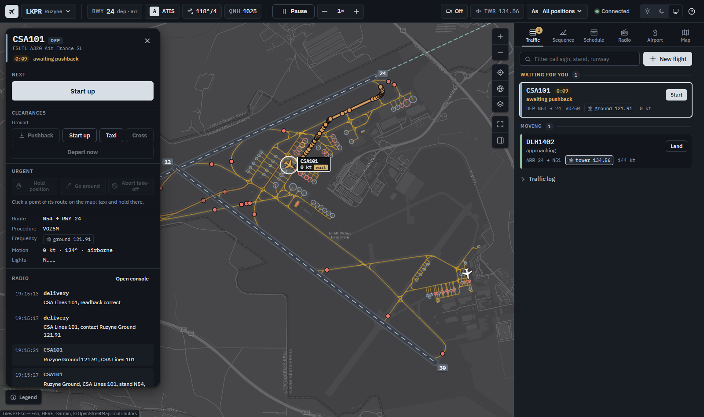

# mrlm-net/simconnect

[](https://pkg.go.dev/github.com/mrlm-net/simconnect)
[](https://simconnect.mrlm.net/)
[](LICENSE)

> **Go wrapper for SimConnect.dll** — build Microsoft Flight Simulator 2020/2024 add-ons with type-safe, zero-dependency Go code.

## Features

### Engine — Direct SimConnect Access
- Full SimConnect DLL binding via syscalls — zero CGo, Windows-only
- Typed message stream via a Go channel (callback handlers in the Manager)
- Manual and pre-built dataset definitions across 7 domains (aircraft, environment, facilities, navigation, objects, simulator, traffic)
- AI traffic management — create, remove, and control parked, enroute, and non-ATC aircraft with livery selection
- Facility data queries — airports, runways, parking, frequencies, VOR, NDB, waypoints, airways, jetways, helipads, procedures and their legs: 26 ready-made facility datasets
- MSFS 2024 APIs — input events, flow events, CommBus, the add-on camera
- Optional SimConnect.dll auto-detection (`ClientWithAutoDetect`) via environment variables, SDK paths, and common installation locations

### Manager — Production Lifecycle
- Automatic connection lifecycle with reconnection and health monitoring
- 60+ SimVar state tracking via SimState — camera, position, speed, weather, VR, environment, realism settings
- Channel-based and callback-based subscriptions with message type filtering
- 12 typed system event handlers — Pause, Sim, Crashed, CrashReset, Sound, View, FlightLoaded, AircraftLoaded, FlightPlanActivated, FlightPlanDeactivated, ObjectAdded, ObjectRemoved

### Airport & Ground Traffic
- Airport ground layout from facility data — runways with both ends, parking stands (`C22`, `S22A`), taxi points with hold-shorts, taxi paths and taxiway names
- Taxi graph and routing — stand → runway hold-short with taxiway sequence and runway crossings; GeoJSON export
- Departure taxi controller — spawn an AI aircraft at a stand, push back (with a tug), taxi, hold short and take off; SIDs and generated flight plans after the take-off
- Arrivals — STAR and approach, injected landing, runway exit, taxi-in and parking on a suitable stand; turnarounds
- Injected ground movement — smooth turns, real speeds, lights as set, give way and queue behind traffic, pushback that waits for traffic behind; ATC commands (hold position, go around, abort take-off); de-icing; natural timing
- Traffic picture — every aircraft around a configurable centre of the world (an airport, a position, or following the user) with phases and the airports in range
- Scheduled traffic — timetables from airlines, fleets, routes and time-of-day waves; a traffic manager that spawns them, turns arrivals around, and adjusts to what it sees (landing flow, ground stops, late inbounds, stuck aircraft), respecting or ignoring traffic that is not ours; lifecycle events for your own state machine
- Enroute traffic and overflights — aircraft appear airborne mid-route on their flight plan and are handed to the arrival at the STAR entry
- Many aircraft at once — level of detail (fewer frames far away or standing still), reusable ID blocks
- Library components never own the message stream: your loop feeds `Handle(msg)`, so they work alongside the Manager

### Airborne ATC
- Wake turbulence separation (ICAO and RECAT-EU) and spacing on final that follows the weather (low visibility, runway state, wind)
- A landing sequence per runway, first come first served, re-sequencing go-arounds; arrivals lose delays by speed, then a longer downwind, then a hold with its stack
- A tower per runway: line-up, take-off and crossing clearances in mixed mode; automatic go-arounds on the published missed approach
- Airborne conflicts predicted five minutes ahead and resolved by the least disturbing speed, level or heading change
- Standard-rate turns by airframe instead of MSFS AI's hard turns at waypoints; injected take-off with engine spool-up and a stable glide path to touchdown, crabbed into a crosswind and de-crabbed in the flare, the touchdown point varying a little from landing to landing
- A runway change re-plans the traffic not yet committed: new SID or STAR, a new taxi route from where each aircraft is
- On the airport map: the landing sequence with its final ladder, the tower and the final's spacing, and controls to work it by hand

### Radio & Voice
- Every clearance as a structured transmission (position, intent, parameters) with the text as said, on each position's frequency, with hand-offs and check-ins, pilot requests and readbacks, the ATIS on its frequency
- The gate-to-gate flow: delivery clearance, push and start (with the facing), taxi, line-up (also behind a landing aircraft), take-off with the wind, identified and climb, arrival and approach clearances with the QNH, landing, vacating; expedited forms; weather and direct requests
- ICAO wording by default and the FAA's at US airports, both checked against the quoted documents ([Phraseology](docs/traffic-phraseology.md))
- Spoken through [voice-goio](https://github.com/mrlm-net/voice-goio) on the airport map: a voice per controller (with shift changes) and per crew, a radio chain, following or tuning COM1

### Camera
- The MSFS 2024 add-on camera bound on the engine; `pkg/camera` places it relative to the world or an aircraft, with eased moves, spline paths and drone moves (reveal, flyover, side dolly, lead chase, details of engines, gear, cockpit…) and a director that plays them
- On the airport map: an auto director cutting to the aircraft on the radio, and scripted scenes (JSON) for films

### Navigation & Weather
- Airways crawled from the simulator's navigation data and routed (A*); weather at the user aircraft, the runway in use, ATIS
- Flight plans between airports — SID, airways, STAR and approach, cruise level, vertical profile, fuel; MSFS `.pln` export

### Utilities
- Great-circle distance (haversine), altitude/distance/speed conversions, ICAO validation, WGS84 coordinate offsets
- Tiered buffer pooling and pre-allocated handler buffers for zero-allocation dispatching

*Zero external dependencies — standard library only.*

## Quick Start

```go
package main

import (
    "github.com/mrlm-net/simconnect"
)

func main() {
    client := simconnect.NewClient("MyApp", simconnect.ClientWithHeartbeat(simconnect.HEARTBEAT_6HZ))
    if err := client.Connect(); err != nil {
        panic(err)
    }
    defer client.Disconnect()
    // … interact with the simulator
}
```

## The airport map

Start with the **[airport map](cmd/airport-map)**: the traffic control app built on this SDK and the tool it is debugged with. It shows an airport's ground layout as SimConnect reports it, taxi routes, AI traffic under your control with every clearance on the radio, scheduled airline traffic, the landing sequence, the tower, the camera and the ATC game. It works on a desktop, a tablet or a phone, and several people can play over the network, each working one position:

```shell
cd cmd/airport-map && go run .
# open http://127.0.0.1:8080/?icao=LKPR
# on the network (tablets, phones, other controllers): go run . -addr :8080
```



## Examples

[Examples](docs/examples.md) has a tour of the map with screenshots and a line on every other example. Each is a standalone `main` package; run one with `go run ./examples/<name>`:

- **Connection & Manager** — [basic-connection](examples/basic-connection), [await-connection](examples/await-connection), [lifecycle-connection](examples/lifecycle-connection), [simconnect-manager](examples/simconnect-manager), [simconnect-subscribe](examples/simconnect-subscribe), [simconnect-state](examples/simconnect-state), [simconnect-events](examples/simconnect-events), [simconnect-benchmark](examples/simconnect-benchmark)
- **Data & Events** — [read-messages](examples/read-messages), [read-objects](examples/read-objects), [set-variables](examples/set-variables), [using-datasets](examples/using-datasets), [emit-events](examples/emit-events), [subscribe-events](examples/subscribe-events), [flow-events](examples/flow-events)
- **Facilities** — [read-facility](examples/read-facility), [read-facilities](examples/read-facilities), [subscribe-facilities](examples/subscribe-facilities), [all-facilities](examples/all-facilities), [airport-details](examples/airport-details), [locate-airport](examples/locate-airport), [read-waypoints](examples/read-waypoints), [simconnect-facilities](examples/simconnect-facilities)
- **Traffic** — [ai-taxi](examples/ai-taxi) (stand → runway departure), [ai-arrival](examples/ai-arrival) (landing, runway exit, taxi-in), [ai-traffic](examples/ai-traffic), [manage-traffic](examples/manage-traffic), [monitor-traffic](examples/monitor-traffic), [simconnect-traffic](examples/simconnect-traffic)
- **Navigation & Weather** — [atis](examples/atis), [flight-plan](examples/flight-plan), [spike-airways](examples/spike-airways)
- **Spikes** — `examples/spike-*`: one-off experiments behind the traffic features

## CLI Tools

### simvar-cli

`simvar-cli` is a Windows command-line tool for reading, writing, and streaming MSFS SimVars directly from a terminal. It connects to a running simulator via SimConnect and supports JSON, CSV, and table output formats.

```shell
# Build from source
cd cmd/simvar-cli
go build -o simvar-cli.exe .

# Read a SimVar
simvar-cli get "PLANE ALTITUDE" feet float64

# Stream continuously as NDJSON
simvar-cli --format json watch "PLANE ALTITUDE" feet float64

# Interactive REPL
simvar-cli repl
```

See [`cmd/simvar-cli`](cmd/simvar-cli) for a quick start and [`docs/simvar-cli.md`](docs/simvar-cli.md) for the complete reference.

## Documentation

**[simconnect.mrlm.net](https://simconnect.mrlm.net/)** — the documentation website, built from [`docs/`](docs).

- **Start** — [Getting Started](docs/getting-started.md), [Examples](docs/examples.md)
- **Engine** — [Configuration](docs/config-client.md), [Usage](docs/usage-client.md), [AI Objects](docs/engine-ai-objects.md), [Facility Data](docs/guide-facilities.md), [Input Events](docs/guide-input-events.md), [Client Data Areas](docs/client-data-area.md), [Event Lifecycle](docs/events-lifecycle.md)
- **Manager** — [Configuration](docs/config-manager.md), [Usage](docs/usage-manager.md), [Request and ID Management](docs/manager-requests-ids.md), [Input Events](docs/manager-input-events.md), [Client Data Areas](docs/manager-client-data-area.md)
- **Data** — [Using Datasets](docs/usage-datasets.md), [Dataset Composition](docs/dataset-composition.md), [SimVar Registry](docs/pkg-registry.md), [Dictionaries](docs/dictionaries.md), [Geodesy and Unit Conversion](docs/utilities.md)
- **Airport & nav** — [Airport Layout & Taxi Routing](docs/airport-layout.md), [Airways](docs/nav-airways.md), [Weather & ATIS](docs/nav-weather.md), [Flight Plans](docs/nav-flight-plans.md)
- **Traffic** — [Traffic Guide](docs/traffic-guide.md), [Departure Taxi](docs/traffic-taxi.md), [Arrivals & Parking](docs/traffic-arrival.md), [Injected Ground Movement](docs/traffic-motion.md), [ATC Commands](docs/traffic-commands.md), [Aircraft Profiles](docs/traffic-profiles.md), [Traffic Picture](docs/traffic-picture.md), [Schedules](docs/traffic-schedules.md), [Traffic Manager](docs/traffic-manager.md), [Airborne Separation](docs/traffic-separation.md), [Radio](docs/traffic-radio.md), [Phraseology](docs/traffic-phraseology.md), [VFR Traffic](docs/traffic-vfr.md), [Traffic Decisions](docs/traffic-decisions.md), [Traffic World](docs/traffic-world.md), [ATC Game](docs/atc-game.md), [Camera](docs/camera.md)
- **Aircraft & add-ons** — [Aircraft Systems Profiles](docs/systems.md), [Radios and Transponder](docs/avionics.md), [GSX](docs/gsx.md), [L:vars](docs/lvars.md), [Installed Add-ons](docs/addons.md)
- **Tools** — [SimVar CLI](docs/simvar-cli.md)

## Packages

- **[`simconnect`](https://pkg.go.dev/github.com/mrlm-net/simconnect)** — Main entry point — `New()` for managed connection, `NewClient()` for direct engine access
- **[`pkg/engine`](https://pkg.go.dev/github.com/mrlm-net/simconnect/pkg/engine)** — High-level client, session lifecycle, message dispatching
- **[`pkg/manager`](https://pkg.go.dev/github.com/mrlm-net/simconnect/pkg/manager)** — Connection manager with auto-reconnect and state tracking
- **[`pkg/types`](https://pkg.go.dev/github.com/mrlm-net/simconnect/pkg/types)** — Typed data structures, enums, events
- **[`pkg/datasets`](https://pkg.go.dev/github.com/mrlm-net/simconnect/pkg/datasets)** — Pre-built dataset definitions (aircraft, environment, facilities, navigation, objects, simulator, traffic)
- **[`pkg/airport`](https://pkg.go.dev/github.com/mrlm-net/simconnect/pkg/airport)** — Airport ground layout, taxi graph, routing, GeoJSON
- **[`pkg/traffic`](https://pkg.go.dev/github.com/mrlm-net/simconnect/pkg/traffic)** — AI aircraft: departures, arrivals, injected motion, traffic picture, schedules, traffic manager; `pkg/traffic/world` is the airport map's traffic engine as a package
- **[`pkg/nav`](https://pkg.go.dev/github.com/mrlm-net/simconnect/pkg/nav)** — Airways, routing, weather, runway in use, ATIS, flight plans
- **[`pkg/camera`](https://pkg.go.dev/github.com/mrlm-net/simconnect/pkg/camera)** — MSFS 2024 add-on camera: poses, shots, a Director
- **[`pkg/avionics`](https://pkg.go.dev/github.com/mrlm-net/simconnect/pkg/avionics)** — User aircraft radios: COM frequencies, swap, transponder code
- **[`pkg/systems`](https://pkg.go.dev/github.com/mrlm-net/simconnect/pkg/systems)** — User aircraft systems through a default profile and per-model overrides
- **[`pkg/addons`](https://pkg.go.dev/github.com/mrlm-net/simconnect/pkg/addons)** — Installed packages, the loaded aircraft's package, running processes (no SimConnect)
- **[`pkg/dict`](https://pkg.go.dev/github.com/mrlm-net/simconnect/pkg/dict)** — Makes the library's embedded tables replaceable at runtime
- **[`pkg/convert`](https://pkg.go.dev/github.com/mrlm-net/simconnect/pkg/convert)** — Unit conversions, ICAO validation, WGS84 coordinate offsets
- **[`pkg/calc`](https://pkg.go.dev/github.com/mrlm-net/simconnect/pkg/calc)** — Geodesy: great-circle distance and bearing, cross/along-track, displacement, Dubins paths, magnetic variation, wind components
- **[`pkg/gsx`](https://pkg.go.dev/github.com/mrlm-net/simconnect/pkg/gsx)** — GSX Pro state from its L:vars, and the names add-ons may set
- **[`pkg/lvars`](https://pkg.go.dev/github.com/mrlm-net/simconnect/pkg/lvars)** — Write L:vars on the user aircraft
- **[`pkg/registry`](https://pkg.go.dev/github.com/mrlm-net/simconnect/pkg/registry)** — Cross-platform typed SimVar metadata catalogue (121 entries, no build tags)
- **[`cmd/simvar-cli`](cmd/simvar-cli)** — Interactive CLI tool for reading, writing, and streaming SimVars

## Installation

```shell
go get github.com/mrlm-net/simconnect
```

## Requirements

| Requirement | Version |
|-------------|---------|
| Go | 1.27.1+ |
| Operating system | Windows |
| Microsoft Flight Simulator | 2020 / 2024 |
| SimConnect.dll | From the MSFS SDK (default path `C:/MSFS 2024 SDK/SimConnect SDK/lib/SimConnect.dll`, or auto-detected) |

## Contributing

_Contributions are welcomed and must follow the [Code of Conduct](https://github.com/mrlm-net/simconnect?tab=coc-ov-file) and common [Contribution guidelines](https://github.com/mrlm-net/.github/blob/main/docs/CONTRIBUTING.md)._

> If you'd like to report a security issue please follow the [security guidelines](https://github.com/mrlm-net/simconnect?tab=security-ov-file).

## Sponsoring

This library is developed and maintained in personal time. Sponsorship helps cover the direct costs of keeping it accurate and active:

- **MSFS 2024 license** — required to test against the current simulator version
- **Windows development environment** — the only supported platform; ongoing hardware and OS costs
- **Documentation hosting** — simconnect.mrlm.net is served from a paid static hosting account
- **Development time** — research against undocumented SimConnect behaviors, writing typed wrappers, and reviewing contributions

If this library has saved you time, a one-time or recurring contribution via [Revolut](https://revolut.me/mrlm?currency=EUR) is appreciated. There is no obligation.

## License

Business Source License 1.1, see [LICENSE](LICENSE), for versions after v0.18.4. Non-commercial use is free: personal and hobby use, the flight-simulation community, education, research and non-profits. Commercial use, such as a paid add-on or product, a paid service or use inside a business, needs a separate licence; [open an issue](https://github.com/mrlm-net/simconnect/issues) to ask. Each version becomes Apache-2.0 four years after it is published, and versions up to and including v0.18.4 remain under Apache-2.0.

---

<sup><sub>_All rights reserved © Martin Hrášek [<@mrlm-xyz>](https://github.com/mrlm-xyz) and WANTED.solutions s.r.o. [<@wanted-solutions>](https://github.com/wanted-solutions)_</sub></sup>
