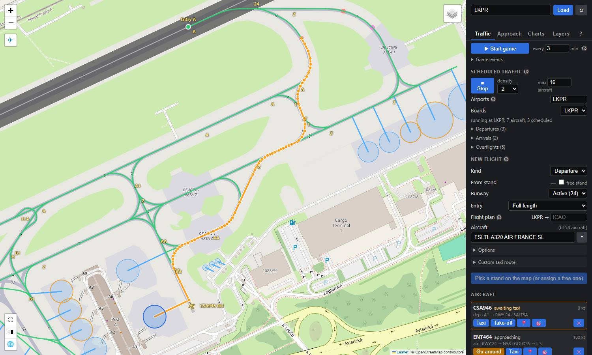
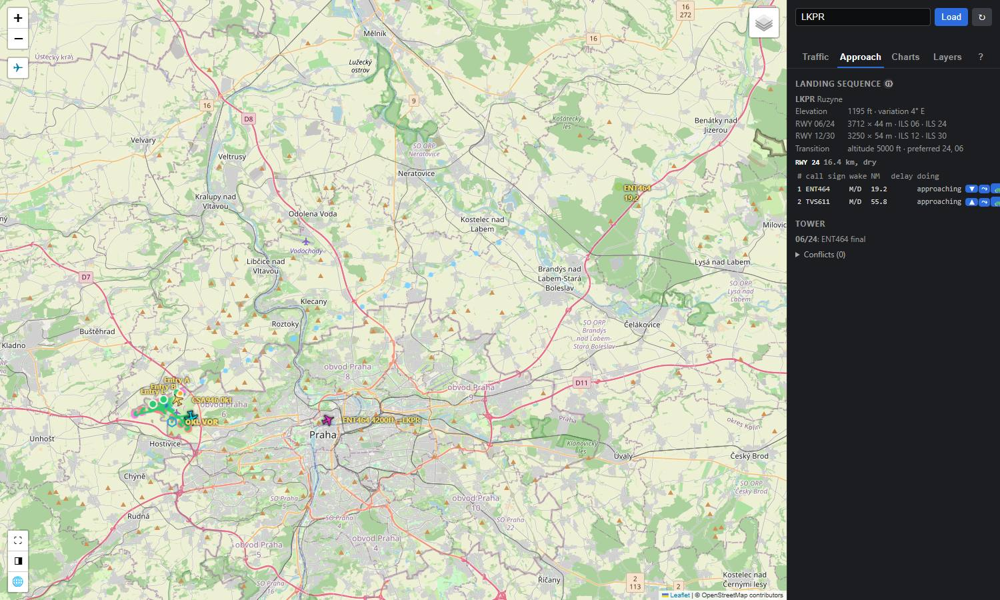

# airport-map

A live map of an airport and its traffic, built only on the SDK. It is the SDK's main example and the tool it is debugged with: the ground layout exactly as SimConnect reports it, taxi routing, AI traffic under your control, scheduled airline traffic, the landing sequence, the tower and the ATC game.


The layout comes from [`pkg/airport`](../../docs/airport-layout.md): `airport.Loader` fetches the facility data from the application's message loop, `airport.Cache` keeps layouts and taxi graphs, and routes come from the `Graph`. Every feature's popup shows its raw facility index and field values, so the taxi graph can be checked against the real data. The traffic is [`pkg/traffic`](../../docs/traffic-guide.md); procedures, weather and flight plans are [`pkg/nav`](../../docs/nav-weather.md).

## Run

The map is its own module (it speaks through [voice-goio](https://github.com/mrlm-net/voice-goio), and the SDK keeps zero dependencies), so run it from its folder:

```bash
cd examples/airport-map

# Live: connect to the simulator and open LKPR
go run .

# Also save each fetched airport's raw data to <ICAO>.json
go run . -dump

# Offline: serve a saved dump, no simulator needed (layout and routes only)
go run . -file LKPR.json
```

Open <http://127.0.0.1:8080/?icao=LKPR>. Type another ICAO code in the side panel to load it; **↻** fetches it again from the simulator.

| Flag | Default | Description |
|------|---------|-------------|
| `-addr` | `127.0.0.1:8080` | HTTP listen address |
| `-icao` | `LKPR` | Airport opened on start |
| `-dump` | `false` | Write each fetched airport's raw facility records (`airport.RawAirport`) to `<ICAO>.json`; the same format as `pkg/airport/testdata` |
| `-dump-dir` | `.` | Directory for `-dump` files |
| `-file` | | Serve a `-dump` file instead of connecting to the simulator |
| `-log-dir` | `.` | Directory for the traffic control log, `traffic-<YYYYMMDD-HHMMSS>.log` (one file per run) |
| `-piper` | `bin/piper/piper.exe` | piper executable for the voice (see [Voice](#voice)) |
| `-voices` | | Folder of piper voice models; empty: voice-goio's user data folder |
| `-airways` | `pkg/nav/testdata/LKPR-airways.json` | Airway graph for flight plans (see [`spike-airways`](../spike-airways)); `""` for direct routes |

The map page loads Leaflet from cdnjs and map tiles from OpenStreetMap and Esri, so the browser needs internet access.

A tour with more screenshots is in [Examples](../../docs/examples.md).

## Voice

The **Radio** tab's **🔇 Sound off** button turns the voice on: what is said on the frequency you follow is spoken through voice-goio, one frequency at a time as on a receiver. Each controller position has its own voice and radio sound, each crew its own voice, and tuned to the ATIS you join its continuous broadcast where it is. The airport panel's 🔊 reads the ATIS once. On a busy frequency the pauses shorten; only what could not be said within 60 s is dropped.

The voice needs [piper](https://github.com/rhasspy/piper) and at least one English voice model:

1. Download `piper_windows_amd64.zip` from the [piper releases](https://github.com/rhasspy/piper/releases) and unzip it so that `examples/airport-map/bin/piper/piper.exe` exists (or pass `-piper`).
2. Download voice models with voice-goio's tool, e.g. `go run github.com/mrlm-net/voice-goio/cmd/voicecheck@v0.3.1 download -model en_GB-alan-medium` (and `en_US-ryan-medium`, `en_GB-vctk-medium` for more voices). `voicecheck voices` lists what is installed.

Without them the button says what is missing and the map stays silent; the ATIS button falls back to the browser's English voice.

## The panel

The side panel has a tab per task; **?** is the quick reference of every button, clearance and colour. The map buttons: **✈** shows your aircraft, **⛶** full screen (panel included), **◨** hides the panel, **🌐** the world view, **🎯** (on a card) follows an aircraft.

| Tab | What is in it |
|-----|---------------|
| **Traffic** | The [ATC game](../../docs/atc-game.md); scheduled traffic with its departure, arrival and overflight boards; **New flight** to spawn one aircraft; the **Aircraft** cards with their clearances; the traffic log |
| **Approach** | The landing sequence per runway with its controls, the tower, the predicted conflicts; the final drawn on the map |
| **Charts** | The airport, de-icing pads, the weather at your aircraft and the runway in use, the ATIS (🔊 reads it out), SIDs, STARs and approaches on the map |
| **Layers** | Airport data, the traffic picture (centre and radius), live traffic (ours, other traffic, safe zones), taxiway names, overlapping stands, taxi paths and points by `TYPE` |
| **?** | Quick reference |

## What it shows

- **Taxi paths** per `TYPE` (0 NONE … 8 PAINTEDLINE), each its own toggleable layer. Paths with an endpoint index outside the point/parking lists are drawn as magenta rings.
- **PARKING paths** are drawn from their START taxi point to the parking spot at END (END indexes the parking list for PARKING paths, verified on LKPR).
- **Taxi points** by `TYPE`; hold-short types (2, 4, 5, 6) get their own layer.
- **Parking spots** as circles of their `RADIUS`, labelled from `NAME`, `NUMBER` and `SUFFIX` (e.g. `C22`, `S22A`). Stands whose circles overlap are outlined in orange.
- **Routes:** click a parking spot and pick a runway. A departure shows the route to the runway (full length or from an entry), its taxiways, length, runway crossings and hold-short; an arrival the taxi-in from a runway exit, with the vacate point and the stop on the stand.
- **Our aircraft** coloured by what they are: under our control (a card), arriving en route, overflying, departed. **Other traffic** (MSFS AI and other add-ons) on the Layers tab, off by default.
- **Safe zones:** half the wing span plus 3 m around every aircraft on the ground; red where two overlap.
- **World view (🌐):** the traffic picture's circle, the airports in range and every aircraft with call sign, level and phase.

## Traffic control

While connected to the simulator, the **Traffic** tab spawns AI aircraft driven by [`pkg/traffic`](../../docs/traffic-arrival.md) and gives their clearances.

- **New flight:** pick the kind (departure or arrival), click a stand (or tick *free stand*: one that fits, the airline's own first) and pick the runway (*Active* follows the runway in use from the weather) and an entry or exit. The route is previewed and **▶ Spawn** says what it will do. A departure pushes back, taxis, lines up and takes off; an arrival lands and taxis to the stand.
- **Aircraft:** a searchable list of the aircraft the simulator can spawn (`Title :: Livery`).
- **Options:** hold at every clearance (unticked, the gates clear themselves after a short wait); pushback tug; fly the approach by injection (off: MSFS AI lands); turnaround after a dwell; fly the procedures (SID after take-off, arrivals start at a STAR entry); a flight plan to or from another airport over the airways; de-icing on the stand or at a pad.
- **Custom taxi route:** via points picked on the map and taxiway names, in order.
- **Stands:** a stand held by another aircraft is refused with the reason. The **Occupied stands** layer shows reserved stands in blue and aircraft found on stands in red.
- **Clearances:** each card shows the state, speed and the clearances available now: Pushback, Taxi, Cross, Line up, Take-off, Depart now (turnaround), and when something is in the way Hold position, Go around, Abort take-off ([Traffic Commands](../../docs/traffic-commands.md)). ✕ removes the aircraft.
- **Progressive taxi:** select a card to draw its route; click a route point to clear it up to there. The limit is drawn in magenta. **Taxi** removes the limit. A selected arrival in the air shows the route it still flies (dashed) and its hold.



### Scheduled traffic

**Scheduled traffic ▶ Start** has airlines fly a timetable at the loaded airport (or several), with a density and a maximum number of aircraft: departures board and push at their STD, arrivals come in on STARs for their STA (en route under MSFS AI first), overflights cross the area at cruise level, and turnarounds depart again. The boards show STD/STA, estimates and why a flight waits. See [Traffic Schedules](../../docs/traffic-schedules.md) and [Traffic Manager](../../docs/traffic-manager.md).

### Approach and tower

Every runway in use has an approach sequencer and a tower ([Airborne Separation](../../docs/traffic-separation.md)):

- **Landing sequence:** the landing order with wake spacing that follows the weather. Delays are absorbed by speed, then path stretching on the STAR, then a hold at the STAR's hold fix on a stack; the sequencer releases the holds.
- **Controls** on the Approach tab: ▲▼ change the order (kept), ⤳ direct to the final, 🐢 lose another minute, ⟳ hold, ⏵ leave the hold, ↺ go around.
- **Tower:** line-up, take-off and crossing clearances when the runway is free, the interval after the last departure has passed and the next arrival is far enough out.
- **Separation:** every airborne pair under 5 NM and 1000 ft is logged; pairs predicted to come that close get the least disturbing change to one of our en route aircraft (speed, level or a heading), said as ATC would.



### Traffic log

Clearances appear as ATC says them, with the taxiways: "AFR1383, push back and start-up approved", "AFR1383, taxi to holding point runway 24 via B2, H, A", "AFR1383, taxi via B2, H, hold short of A" (up to a route point), "AFR1383, runway 24, line up and wait". With gates off the controller clears itself, and the log still shows the clearance.

Everything traffic control does is logged: spawns, clearances given or refused, state changes (with the touchdown distance and rate), light changes, sequence changes, holds, separation, and errors. Each line is time-stamped and goes to the console, to the log file in `-log-dir`, and to the **Traffic log** (the last 200 lines).

## HTTP API

The page uses these; scripts and tests can too.

| Endpoint | Response |
|----------|----------|
| `GET /api/airport?icao=XXXX[&refresh=1]` | The `airport.Layout` plus `fetchedAt` |
| `GET /api/geojson?icao=XXXX` | The layout as a GeoJSON FeatureCollection |
| `GET /api/route?icao=XXXX&from=<parking index>&to=<runway end>[&entry=<taxiway>]` | `airport.Route` from `RouteToRunwayEntry` (empty entry = full length; `&runwayPaths=1` allows taxiing on runway paths) |
| `GET /api/node?icao=XXXX&lat=..&lon=..` | The taxi graph node nearest a point (within 150 m) and its taxiway names |
| `GET /api/entries?icao=XXXX&runway=<runway end>` | `airport.RunwayEntry` list, each with the `position` where it meets the runway |
| `GET /api/exits?icao=XXXX&runway=<runway end>` | `airport.RunwayExit` list for landings on that end, nearest the threshold first, each with its `position` |
| `GET /api/arrival?icao=XXXX&runway=<runway end>&to=<parking index>[&exit=<index>]` | Arrival plan from `traffic.PlanArrival`: `route`, `exit`, `vacate` and `stop` positions |
| `GET /api/airportinfo?icao=XXXX` | The airport, weather at the user aircraft, runway in use and ATIS |
| `GET /api/procedures?icao=XXXX` | SIDs, STARs and approaches with their paths |
| `GET /api/aircraft` | User aircraft position, or `204` when unavailable |
| `GET /api/traffic` | Every aircraft within 20 km of the user aircraft: title, tail, AI state, position, height, speeds, heading, on-ground, gear, `user` flag |
| `GET /api/world` | The traffic picture: centre, radius, airports in range, every tracked aircraft |
| `POST /api/world` | Set the picture's centre (`follow`, `icao` or `lat`/`lon`) and `radiusNM` |
| `POST /api/world/remove` | `{"objectId":N}`: remove an aircraft that is not ours |
| `GET /api/control` | Controlled aircraft: id, kind, tail, model, stand, runway, procedure, state, `holdingShortOf`, `atLimit`, `limitNode`, position, heading, ground speed, lights, error, `route` / `nodes`, `actions` (clearances available now), `airRoute`, `hold`, `done` |
| `POST /api/control` | Spawn a controlled aircraft. JSON body: `kind` (`departure` or `arrival`), `icao`, `stand` (parking index), `runway` (`active` or empty: the runway in use), `entry`, `exit`, `model`, `tail`, `gates`, `injectApproach`, `tug`, `turnaround`, `dwellSec`, `procedure`, `other` (the other airport of a flight plan), `via`, `taxiways`, `deice`. Returns its view; `422` if refused, `503` when not connected |
| `POST /api/control/{id}/{action}[?node=N]` | A clearance: `pushback`, `taxi`, `upto` (with `node`), `cross`, `lineup`, `takeoff`, `depart`, `hold`, `goaround`, `abort`, `remove`. `204` on success, `422` with the reason when refused, `404` for an unknown id |
| `GET /api/control/log` | The last 200 traffic log lines, newest last |
| `GET /api/stands?icao=XXXX` | Held stands: index, label, owner, detected, object ID, half span |
| `GET /api/models` | The aircraft titles the simulator can spawn, as `Title :: Livery` |
| `GET /api/schedule` | Scheduled traffic: enabled, airports, density, maximum, others, active count, flights |
| `POST /api/schedule` | Start, stop or change it: `enabled`, `icao` or `airports`, `density`, `maxAircraft`, `seed`, `others` (`respect` or `ignore`) |
| `GET /api/boards?icao=XXXX` | The departure and arrival boards of an airport |
| `GET /api/sequence?icao=XXXX` | The landing sequence per runway: conditions, LVP, and each arrival's number, wake, spacing, landing time, delay and distance to go |
| `POST /api/approach/{icao}/{callsign}/{action}` | An approach instruction: `up`, `down`, `direct`, `slow`, `hold`, `release`, `goaround`. `204`, `404` when not in a sequence, `409` when refused |
| `GET /api/runways?icao=XXXX` | The tower: per runway, who is on or near it, the phase and what they wait for |
| `GET /api/separation` | Minimum, closest pairs, open and past losses of separation, predicted conflicts and the resolutions given |
| `GET /api/game`, `POST /api/game` | The ATC game: state and score; start (`on`, `icao`, `runway`, `intervalSec`) or stop |
| `GET /api/deicing?icao=XXXX`, `PUT /api/deicing?icao=XXXX` | The airport's de-icing pads, read or replaced |
